## Chat ( Level / XP ) Bot For Telegram Groups Built using Python 

Telegram Username ->  [@Chat_Level_Bot]()  |  Scroll Down for Images

```
setting up:
    -> install requirements.py using command "pip install -r requirements.txt"
    -> make changes in  keys.py file
    -> to start the bot, run bot.py file using command "python bot.py"

starting bot:
    -> got to your bot's personal chat and send command "/help"

```
```
<COMMANDS>
(FOR ALL MEMBERS) 
/me : to see your information. 
/levels : to see level. 
/toplvl : to see users with top levels. 
/toprep : to see users with top reps.

(FOR ADMINS)
/addlvl level_name level_points : to add a new level.
/rmvlvl level_name : to remove a level.

(REPLIED MESSAGES)
/status : to see user information.
/setrank nick_name : to set a custom nickname.
/unsetrank : to remove custom nickname.
w or W or 😼 : to increase rep.
l or L or 💀 : to decrease rep. 
/startbot to start bot in your group after adding it
Talk with GPT AI byt replying to bot
/news for fetching news
contact developer @KingIndra for any help.
```

<hr>

- see status of a member

</img>

<hr>

- add new levels

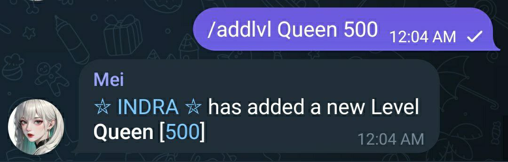</img>

<hr>

- check top level members

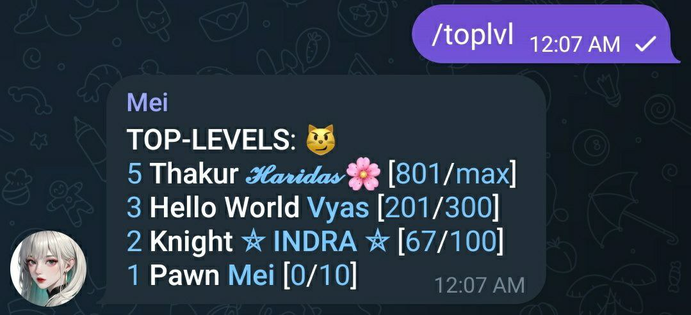</img>

<hr>

- fetch latest news

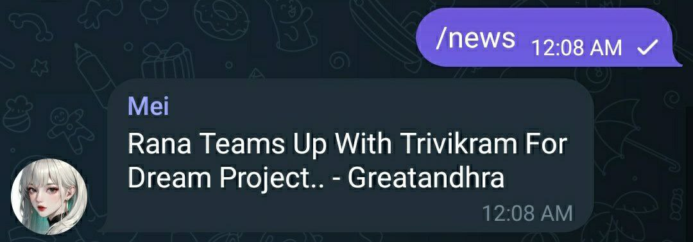</img>

<hr>

- get help

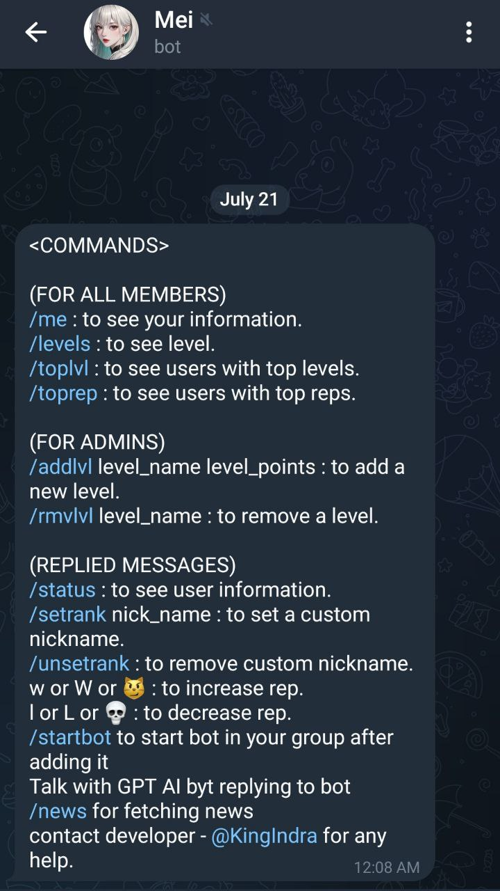</img>

<hr>

- extra commmands for super users

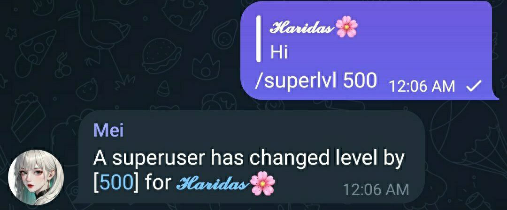</img>

<hr>

- set super rank

</img>

<hr>

- see all levels

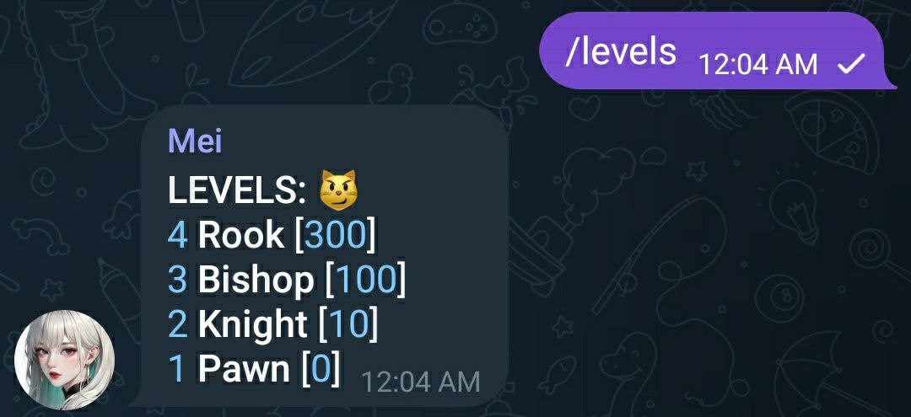</img>

<hr>

- watch top rep members

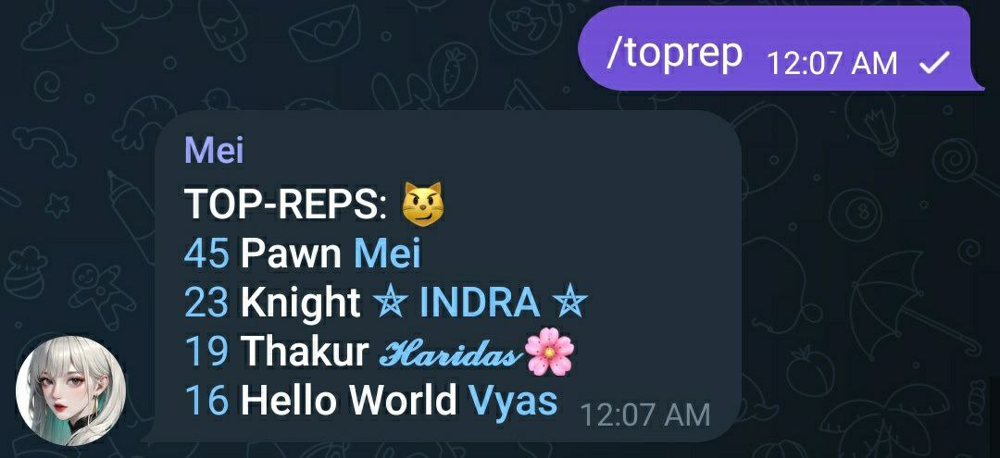</img>

<hr>

- set custom nicknames for members

</img>

<hr>

- check your status

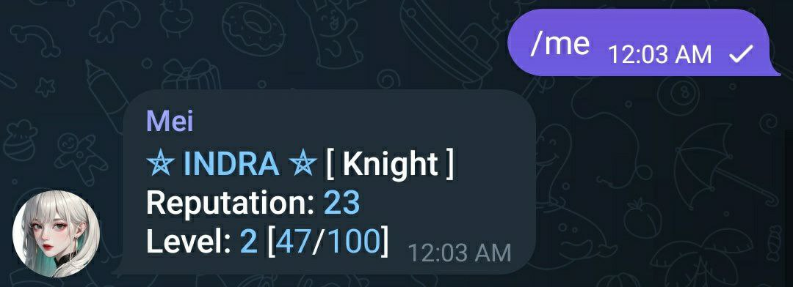</img>

<hr>

- decrease rep of a member

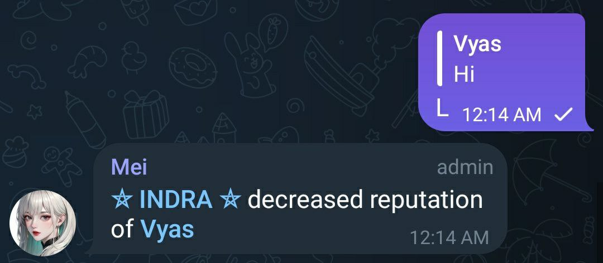</img>

<hr>

- increase rep of a member with emoji

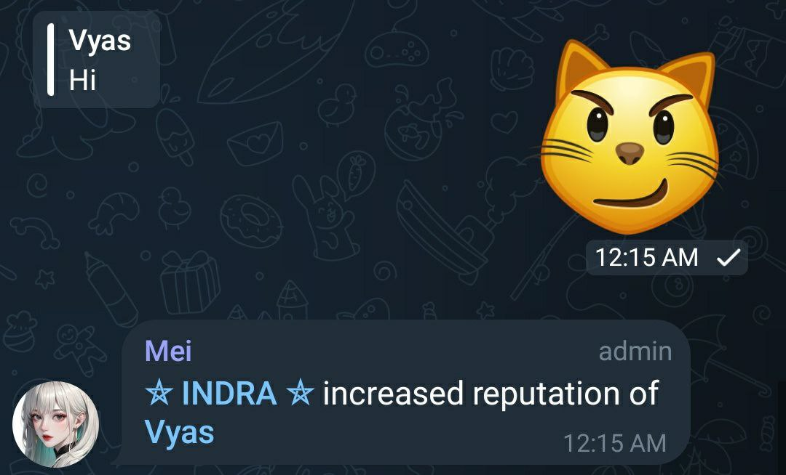</img>

<hr>

- deccrease rep of a member with emoji

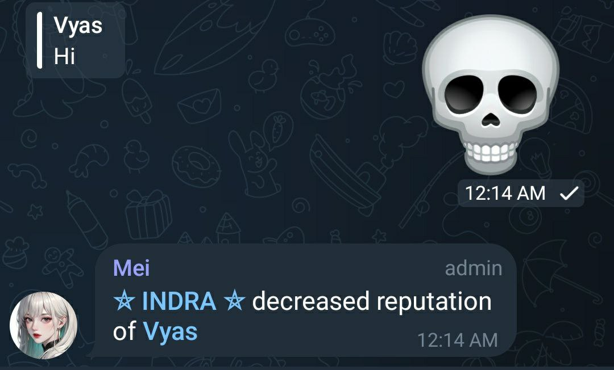</img>

<hr>

### ENJOY 😉